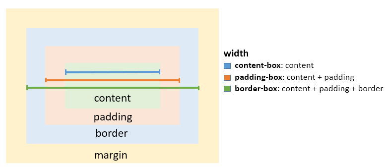

## Resumo CSS - Casvating Style Sheets

#### O que é possível criar com CSS:

* Layout e estilização de páginas web;
* Animações;
* Formas geométricas e desenhos;
* Filtros;
* Contadores;

#### Propriedade e valor
~~~css
propriedade: valor;
Exemplo:
color: white;
~~~

#### CSS inline
Adicionando o código CSS utilizando o atributo **style** dentro das tags HTML, elemento por elemento.
_Exemplo:_
~~~html
<h1 style="background: red; color: white;">CSS in line</h1>
<h2 style="color: red;">Trilha CSS</h2>
~~~
#### CSS Interno:
Código CSS fica dentro da tag <'head'> da página html com a tag <'style'>.
_Exemplo:_
~~~html
<head>
    ...
    

</head>
~~~

#### CSS Externo
Um arquivo externo com extensão .css com todas as regras de estilo que queremos utilizar com uso da tag <'link'> dentro do <'head'> do html.

  * **O CSS externo é o melhor pelos motivos abaixo:**
    * Carregamento da página fica mais rápido;
    * Código fica organizado;
    * Manutenção no código é mais prática devido a organização;
    * Estilos podem ser reutilizados em várias página;

_Exemplo:_
~~~html
 <link rel="stylesheet" href="style.css">
~~~
#### Depurando CSS
Utilizado para identificar problemas no código, através do **Dev Tools**.
* **Atalhos para acessar Dev Tools**
  * Clicar com botão direito do mouse e inspecionar;
  * CTRL + SHIFT + I;
  * CTRL + SHIFT + C;
  * F12;

#### Seletores CSS
* Seletor por **TAG** HTML, especificando a tag;
    ~~~css
    h1{
        background-color: blueviolet;
        color: azure;
    };
    ~~~
* Seletor por **ID** (**#**): Seleciona o id específico;
    ~~~css
        #nome-id {
            color: red;
        }
    ~~~
* Seletor por **Classe** (**.**): Seleciona a classe específica.
    ~~~css
        .nome-classe {
            color: red;
        }
    ~~~
* Seletor **Universal** (**' * '**): Seleciona todos os elementos do HTML;
    ~~~css
        * {
            color: red;
        }
    ~~~
* Seletor de **Atributo** (**[atributo]**) ou (**[atributo="valor"]**): Seleciona elementos que possuem um atributo específico em nosso documento HTML e conseguimos também buscar atributos com um valor específico;
    ~~~CSS
        [title] {
            color: red;
        }/*Vai selecionar todos os elementos que tiverem o atributo "title"*/

        OU

        [title="Netflix"] {
            color: red;
        }/*Vai selecionar todos os elementos que tiverem o atributo "title" e mais o valor "entre aspas", valor EXATO.*/

        OU

        [title~="Net"] {
            color: red;
        }/*Vai selecionar todos os elementos que tiverem o atributo "title" e mais o valor "entre aspas", neste caso busca parte do valor, não necessitar ser idêntico.*/

        OU

        [title|="Net"] {
            color: red;
        }/*Vai selecionar todos os elementos que tiverem o atributo "title" e mais o valor "entre aspas" imediatamente seguido de um hífen.*/

        OU

        PREFIXO
        [title^="Net"] {
            color: red;
        }/*Vai selecionar todos os elementos que tiverem o atributo "title" e que COMECE com o valor entre aspas.*/

        SUFIXO
        [title$="Net"] {
            color: red;
        }/*Vai selecionar todos os elementos que tiverem o atributo "title" e que TERMINE com o valor entre aspas.*/

        ALL
        [title*$*="Net"] {
            color: red;
        }/*Vai selecionar todos os elementos que tiverem o atributo "title" e que CONTENHAM em qualquer parte o valor entre aspas.*/
    ~~~

#### Agurpamento de Seletores
Podemos utilizar as características do CSS simultaneamente em tags, classe, id e atributo, bastando colocar todos separados por **vírgula**, conforme exemplo abaixo:
~~~css
.classe, #id, [atributo]{
    color: red;
  }
  /*Neste caso aplico em todos os elementos a mesma característica*/
~~~

Para Afunilar este filtro e utilizar mais de um elemnto por exemplo podemos filtrat por classe e tag p, basta não ter nem vírgula nem espaço entre os elementos:
~~~css
p.classe#id{
    color: red;
  }
~~~
#### Combinadores

|Seletor|Descrição|Exemplo|
|----|----|----|
|**Seletor descendente**|todos os &lt;span&gt;s que são descendentes de uma &lt;div>|div p {color:red;}|
|**Seletor filho**|todos os &lt;span&gt;s que são filhos diretos de uma <div&gt;|div **>** p {color:red;}|
|**Seletor de irmãos**|todos os &lt;span&gt;s que são irmãos após uma &lt;a&gt;, mesma identação.|p **~** p {color:red;}|
|**Seletor irmão adjacente**|todos os &lt;span&gt;s que estão imediatamente após uma &lt;a&gt;|p **+** p {color:red;}|

#### Palavras Reservadas
|**Palavra**|**Uso**|
|----|----|
|**inhetit**|Herda essa propriedade de seu elemento pai.|
|**initial**|Retorna esta propriedade para seu valor padrão.|
|**transparent**|Especifica que a cor de fundo deve ser transparente. Este é o padrão.|

#### Largura e Altura

* **width** - Determina a largura dos elementos, pode ter a propiedade auto, que vai se ajustar ao conteúdo.
* **max-width** - Definir o valor máximo da largura do elemento;
* **min-width** - Definir a largura mínima que o elemento terá;
* **height** - Determina a altura dos elementos, pode ter a propiedade auto, que vai se ajustar ao conteúdo.
* **max-height** - Definir o valor máximo da altura do elemento;
* **min-height** - Definir a altura mínima que o elemento terá;

#### Margin
Serve para definirmos o espaçamento externo dos elemento, distância entre os elementos.
* Podemos passar de um a quatro valores de margem respectivamente:

    * 1 valor - aplica a mesma margem em todos os lados;
    * 2 valores - aplica a mesma margem em cima/embaixo e na direita/esquerda;
    * 3 valores - aplica a mesma margem em cima, direita/esquerda e embaixo;
    * 4 valores - aplica a mesma margem em cima, direita, embaixo e esquerda, seguindo sentido horário.
  
A propriedade margin possui o atributo inherit e auto.

O atributo auto faz um alinhamento horizontal centralizando o elemento, pode ser combinado com outros atributos.
_**Exemplo:**_
~~~css
    div > div {
        margin: 1ex auto;
        float: left;
    }
~~~
#### Padding
Define o espaçamento interno, entre o elemento e seu conteúdo.
* Assim como na margin podemos inserir 4 valores de padding respectivamente:
    * 1 valor - aplica a mesma margem em todos os lados;
    * 2 valores - aplica a mesma margem em cima/embaixo e na direita/esquerda;
    * 3 valores - aplica a mesma margem em cima, direita/esquerda e embaixo;
    * 4 valores - aplica a mesma margem em cima, direita, embaixo e esquerda, seguindo sentido horário.

#### Box Sizing

O modelo de caixa padrão (content-box) pode ser contra-intuitivo, pois a largura/altura de um elemento não representar sua largura ou altura real na tela assim que você começar a adicionar estilos de preenchimento e borda ao elemento.

O exemplo a seguir demonstra esse possível problema com content-box:
~~~css
    textarea {
        width: 100%;
        padding: 3px;
        box-sizing: content-box; /* default value */
    }
~~~
Como o preenchimento será adicionado à largura da área de texto, o elemento resultante é uma área de texto que é mais larga que 100%.

Felizmente, o CSS nos permite alterar o modelo de caixa com a propriedade **box-sizing** de um elemento. 

* São três valores diferentes para a propriedade **box-sizing**:
    * **content-box**: O modelo de caixa padrão, largura e altura incluem apenas o conteúdo, não o padding ou border. Com este padrão o que vai acontecer quando tiver definido uma largura é que **vai aumentar** o elemento adicionando os valores de padding e margin para deixar o elemento na largura estabelecida no width.
    * **padding-box**: Largura e altura incluem o conteúdo e o preenchimento, mas não a borda;
    * **border-box**: Largura e altura incluem o conteúdo, o preenchimento e a borda. No caso de ter uma largura que quero que seja respeitada pelo elemento, devo usar esta propriedade, que vai automaticamente respeitar a largura definida no width e ajustar o elemtento à margin e ao padding.

_image font: GoalKicker.com - Free Programming Books_